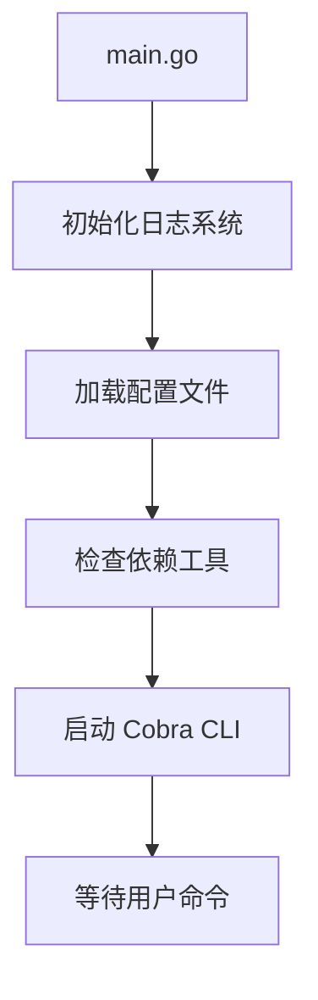
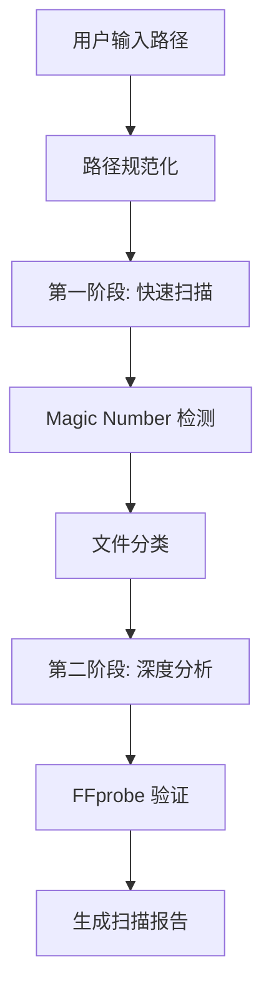
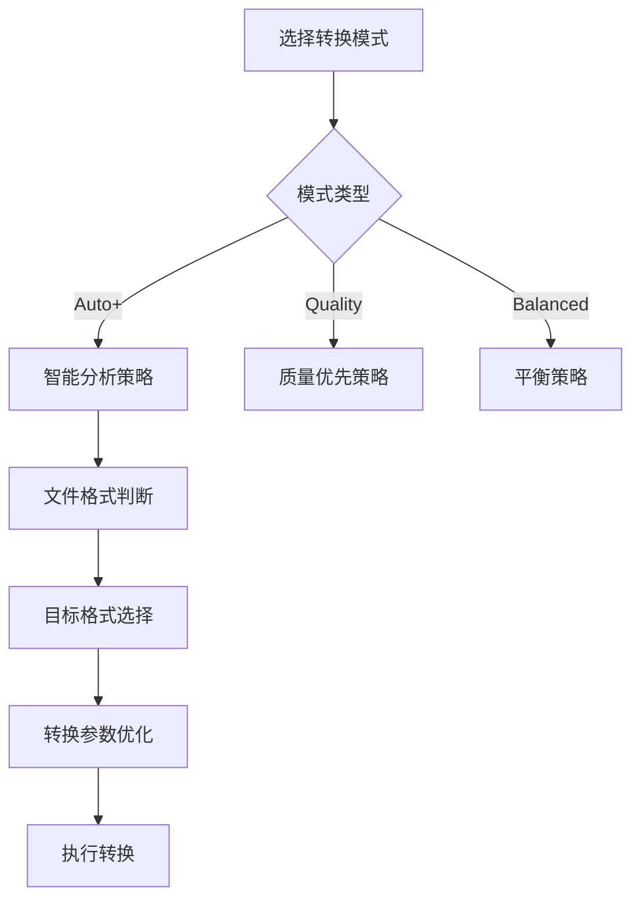
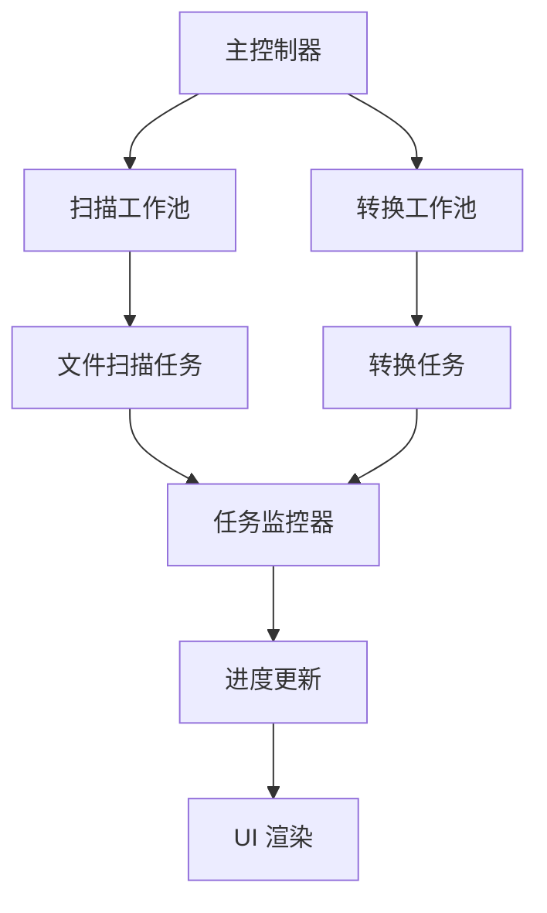

# Pixly 媒体转换引擎 - 全面功能介绍 v1.65.7.2

## 📋 版本信息
- **版本号**: v1.65.7.2
- **发布日期**: 2025-01-04
- **架构类型**: CLI 单体应用
- **核心语言**: Go 1.21+

## 🎯 项目概述

Pixly 是一个高性能、智能化的媒体格式转换引擎，专注于将传统媒体格式转换为现代高效格式（如 JXL、AVIF），在保持视觉质量的同时显著减少文件大小。

### 🌟 核心特性
- **智能转换策略**: 基于文件类型、质量分析的自适应转换
- **高性能并发**: 使用 ants 池实现的企业级并发控制
- **Magic Number 检测**: 双重验证机制确保文件类型准确识别
- **断点续传**: 基于 bbolt 的可靠状态管理
- **现代化 UI**: 支持暗色/亮色主题的交互式命令行界面

## 📁 项目文件结构图

```
Pixly/
├── 🎯 核心入口
│   ├── main.go                    # 程序主入口
│   └── pixly                      # 编译后的可执行文件
│
├── 📋 命令行接口层 (cmd/)
│   ├── root.go                    # Cobra 根命令配置
│   ├── convert.go                 # 转换命令实现
│   ├── analyze.go                 # 分析命令实现
│   ├── settings.go                # 设置管理命令
│   ├── benchmark.go               # 性能基准测试
│   ├── deps.go                    # 依赖检查命令
│   └── version.go                 # 版本信息命令
│
├── 🔧 核心业务逻辑层 (pkg/)
│   ├── 🎨 转换引擎 (converter/)
│   │   ├── batch_processor.go     # 批处理核心引擎
│   │   ├── strategy.go            # 转换策略实现
│   │   ├── image.go               # 图像处理逻辑
│   │   ├── video.go               # 视频处理逻辑
│   │   ├── advanced_pool.go       # 高级并发池管理
│   │   ├── atomic_ops.go          # 原子操作工具
│   │   ├── checkpoint.go          # 断点续传机制
│   │   ├── error_handler.go       # 错误处理中心
│   │   ├── metadata.go            # 元数据处理
│   │   ├── path_utils.go          # 路径工具函数
│   │   ├── report.go              # 报告生成器
│   │   ├── task_monitor.go        # 任务监控器
│   │   ├── tool_manager.go        # 外部工具管理
│   │   ├── watchdog.go            # 看门狗监控
│   │   └── worker_pool.go         # 工作池实现
│   │
│   ├── 🎛️ 配置管理 (config/)
│   │   ├── config.go              # 配置结构定义
│   │   ├── defaults.go            # 默认配置值
│   │   ├── migration.go           # 配置迁移逻辑
│   │   └── config_test.go         # 配置测试
│   │
│   ├── 📊 分析器 (analyzer/)
│   │   └── [分析相关模块]
│   │
│   ├── 🎨 用户界面 (ui/)
│   │   ├── ui.go                  # UI 主控制器
│   │   ├── menu.go                # 菜单系统
│   │   ├── renderer.go            # 渲染引擎
│   │   ├── color_manager.go       # 颜色管理
│   │   ├── emoji_layout.go        # Emoji 布局
│   │   ├── animation.go           # 动画效果
│   │   └── render_channel.go      # 渲染通道
│   │
│   └── 🔧 工具模块
│       ├── deps/                  # 依赖管理
│       ├── emoji/                 # Emoji 处理
│       ├── i18n/                  # 国际化支持
│       ├── progress/              # 进度条组件
│       ├── state/                 # 状态管理
│       ├── theme/                 # 主题系统
│       └── version/               # 版本管理
│
├── 🔧 内部工具层 (internal/)
│   ├── logger/                    # 结构化日志
│   ├── terminal/                  # 终端兼容性
│   ├── testing/                   # 测试工具
│   └── ui/                        # UI 内部组件
│
├── 📚 配置与文档
│   ├── .pixly.yaml               # 主配置文件
│   ├── config/config.yaml        # 备用配置
│   ├── docs/                     # 文档目录
│   │   ├── README_MAIN.MD        # 主要说明文档
│   │   ├── CHANGELOG_v*.md       # 版本更新日志
│   │   ├── API_REFERENCE.md      # API 参考
│   │   ├── USER_GUIDE.md         # 用户指南
│   │   └── TESTING_GUIDE.md      # 测试指南
│   └── reports/                  # 报告输出目录
│
├── 🧪 测试数据与工具
│   ├── test_data/                # 测试数据集
│   ├── TEST_*/                   # 各类测试目录
│   ├── tools/                    # 开发工具
│   └── output/                   # 输出目录
│
└── 📦 项目管理
    ├── go.mod                     # Go 模块定义
    ├── go.sum                     # 依赖校验和
    └── .vscode/                   # VS Code 配置
```

## 🔄 核心工作流程详解

### 1. 程序启动流程



**实现细节**:
- `main.go` 作为程序入口，初始化全局组件
- `internal/logger/logger.go` 配置 zap 结构化日志
- `pkg/config/config.go` 处理 `.pixly.yaml` 配置加载
- `pkg/deps/deps.go` 验证 FFmpeg、ImageMagick 等工具

### 2. 文件扫描与分析流程



**关键实现文件**:
- `pkg/converter/batch_processor.go:quickScan()` - 快速扫描实现
- `pkg/converter/batch_processor.go:detectMagicNumberAndCorrectExtension()` - Magic Number 检测
- `pkg/converter/batch_processor.go:identifyUncertainFiles()` - 可疑文件识别

### 3. 转换策略决策流程



**策略实现**:
- `pkg/converter/strategy.go:AutoPlusStrategy()` - Auto+ 模式实现
- `pkg/converter/strategy.go:QualityModeLogic()` - Quality 模式逻辑
- `pkg/converter/strategy.go:BalancedOptimization()` - 平衡优化策略

### 4. 并发处理架构



**并发实现**:
- `pkg/converter/advanced_pool.go` - 高级并发池管理
- `pkg/converter/worker_pool.go` - 工作池实现
- `pkg/converter/task_monitor.go` - 任务监控

## 🎯 核心功能模块详解

### 1. Magic Number 检测系统

**位置**: `pkg/converter/batch_processor.go:1610-1780`

**功能**: 通过读取文件头部字节识别真实文件格式

**支持格式**:
- 图像: JPG, PNG, GIF, BMP, TIFF, ICO, WEBP, AVIF, HEIC, JXL
- 视频: MP4, MOV, AVI, MKV, FLV, WMV, MPG
- 其他: PSD, SVG, OGG, IVF, Y4M

**实现原理**:
```go
func detectFileFormat(data []byte) string {
    // 检查各种文件格式的 Magic Number
    if len(data) >= 2 && data[0] == 0xFF && data[1] == 0xD8 {
        return "jpg"
    }
    // ... 其他格式检测
}
```

### 2. 智能转换策略

**Auto+ 模式策略**:
- **静态 JXL**: 跳过（已是目标格式）
- **动画 JXL**: 转换为 AVIF
- **WebP**: 性能优化跳过或转换为 JXL
- **PNG/JPEG**: 转换为 JXL
- **动画格式**: 转换为 AVIF

**Quality 模式策略**:
- 优先保持最高质量
- 使用无损或近无损压缩
- 适当增加文件大小以保证质量

### 3. 错误处理与容错机制

**多层错误处理**:
1. **文件级错误**: 损坏文件、权限问题
2. **转换级错误**: 工具失败、格式不支持
3. **系统级错误**: 内存不足、磁盘空间

**容错策略**:
- 工具失败自动重试
- 备用工具链切换
- 优雅降级处理

### 4. 进度监控与UI更新

**渲染架构**:
```go
type RenderChannel struct {
    updates chan UIUpdate
    done    chan bool
}
```

**更新流程**:
1. 工作线程发送进度更新
2. 渲染通道接收并缓冲
3. UI 线程同步更新显示
4. 避免渲染竞争和闪烁

## 📊 性能特性

### 并发性能
- **默认并发数**: `min(4, runtime.NumCPU())`
- **动态调整**: 根据系统负载自适应
- **内存控制**: 智能内存池管理

### 转换效率
- **PNG → JXL**: 平均压缩率 85-95%
- **JPEG → JXL**: 平均压缩率 60-80%
- **动画 → AVIF**: 平均压缩率 70-90%

### 缓存机制
- **扫描结果缓存**: 基于文件哈希的持久化缓存
- **工具检测缓存**: 避免重复依赖检查
- **配置缓存**: 热重载配置更新

## 🔧 配置系统

### 主配置文件 (.pixly.yaml)
```yaml
version: "1.65.7.2"
ui:
  theme: "dark"  # dark/light
  language: "zh-CN"
  emoji_enabled: true

processing:
  scan_workers: 4
  conversion_workers: 4
  max_memory_mb: 1024
  
conversion:
  auto_plus:
    skip_webp: true
    jxl_quality: 90
  quality:
    preserve_metadata: true
    lossless_threshold: 95
```

### 运行时配置
- 通过 CLI 参数覆盖配置文件
- 设置菜单实时修改配置
- 配置变更自动保存

## 🧪 测试与验证

### 测试覆盖范围
1. **单元测试**: 核心算法和工具函数
2. **集成测试**: 完整转换流程
3. **性能测试**: 大文件和批量处理
4. **兼容性测试**: 多平台和格式支持

### 测试数据集
- **标准测试**: `test_data/samples/`
- **压力测试**: `TEST_COMPREHENSIVE/`
- **边界测试**: 损坏文件、特殊格式

## 🚀 部署与使用

### 系统要求
- **操作系统**: macOS, Linux, Windows
- **Go 版本**: 1.21+
- **外部依赖**: FFmpeg, ImageMagick (可选)

### 快速开始
```bash
# 编译
go build -o pixly

# 基本转换
./pixly convert /path/to/images --mode auto+

# 分析文件
./pixly analyze /path/to/media

# 查看设置
./pixly settings
```

## 🔮 未来规划

### v1.66.x 计划
- [ ] GPU 加速支持
- [ ] 云存储集成
- [ ] 批量 API 接口
- [ ] 插件系统架构

### 长期目标
- [ ] Web 界面支持
- [ ] 分布式处理
- [ ] AI 质量评估
- [ ] 实时流处理

## 📝 开发指南

### 代码规范
- 使用 `gofmt` 和 `staticcheck`
- 遵循 Go 官方编码规范
- 强制错误处理和日志记录

### 贡献流程
1. Fork 项目仓库
2. 创建功能分支
3. 编写测试用例
4. 提交 Pull Request
5. 代码审查和合并

---

**文档版本**: v1.65.7.2  
**最后更新**: 2025-01-04  
**维护者**: Pixly 开发团队

> 本文档提供了 Pixly 媒体转换引擎的全面技术概览，用于开发团队的目标预期核对和问题排查。如有疑问或发现问题，请及时反馈。