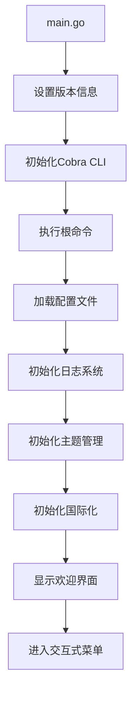
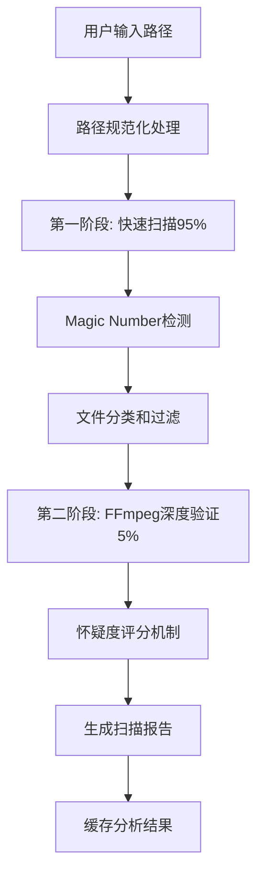
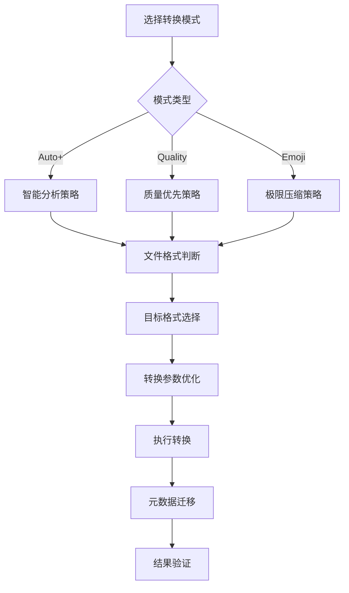
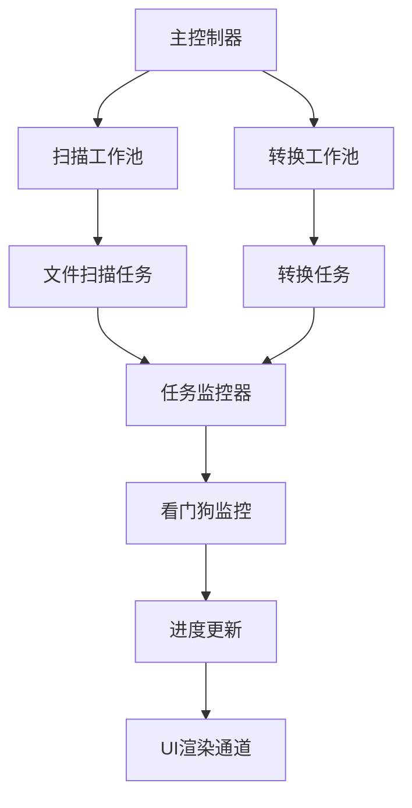

# Pixly 媒体转换引擎 - 全面功能介绍 v1.65.7.3

## 📋 版本信息
- **版本号**: v1.65.7.3
- **发布日期**: 2025-01-04
- **架构类型**: CLI 单体应用
- **核心语言**: Go 1.21+
- **构建版本**: 1.65.6.8

## 🎯 项目概述

Pixly 是一个高性能、智能化的媒体格式转换引擎，专注于将传统媒体格式转换为现代高效格式（如 JXL、AVIF），在保持视觉质量的同时显著减少文件大小。该项目采用严格的工程标准，实现了企业级的稳定性和性能。

### 🌟 核心特性
- **智能转换策略**: 基于文件类型、质量分析的自适应转换
- **高性能并发**: 使用 ants 池实现的企业级并发控制
- **Magic Number 检测**: 双重验证机制确保文件类型准确识别
- **断点续传**: 基于 bbolt 的可靠状态管理
- **现代化 UI**: 支持暗色/亮色主题的交互式命令行界面
- **国际化支持**: 中英文双语界面
- **原子操作**: 确保文件操作的安全性和一致性

## 📁 项目文件结构图

```
Pixly/
├── 🎯 核心入口
│   ├── main.go                    # 程序主入口，设置版本信息并启动CLI
│   └── pixly                      # 编译后的可执行文件
│
├── 📋 命令行接口层 (cmd/)
│   ├── root.go                    # Cobra 根命令配置，交互式菜单系统
│   ├── convert.go                 # 转换命令实现，支持直接转换
│   ├── analyze.go                 # 分析命令实现
│   ├── settings.go                # 设置管理命令
│   ├── benchmark.go               # 性能基准测试
│   ├── deps.go                    # 依赖检查命令
│   └── version.go                 # 版本信息命令
│
├── 🔧 核心业务逻辑层 (pkg/)
│   ├── 🎨 转换引擎 (converter/)
│   │   ├── converter.go           # 转换器主逻辑，双阶段智能分析架构
│   │   ├── batch_processor.go     # 批处理核心引擎，Magic Number检测
│   │   ├── strategy.go            # 转换策略实现(Auto+/Quality/Emoji)
│   │   ├── image.go               # 图像处理逻辑，支持JXL/AVIF/WebP等
│   │   ├── video.go               # 视频处理逻辑，容器重包装优化
│   │   ├── advanced_pool.go       # 高级并发池管理，基于ants库
│   │   ├── atomic_ops.go          # 原子操作工具，确保文件安全
│   │   ├── checkpoint.go          # 断点续传机制，基于bbolt
│   │   ├── error_handler.go       # 错误处理中心，统一错误管理
│   │   ├── metadata.go            # 元数据处理，保留文件信息
│   │   ├── path_utils.go          # 路径工具函数，支持UTF-8/GBK编码
│   │   ├── report.go              # 报告生成器，详细转换统计
│   │   ├── task_monitor.go        # 任务监控器，实时进度跟踪
│   │   ├── tool_manager.go        # 外部工具管理，FFmpeg/ImageMagick
│   │   ├── watchdog.go            # 看门狗监控，防止进程卡死
│   │   └── worker_pool.go         # 工作池实现，并发任务调度
│   │
│   ├── 🎛️ 配置管理 (config/)
│   │   ├── config.go              # 配置结构定义，支持热重载
│   │   ├── defaults.go            # 默认配置值
│   │   ├── migration.go           # 配置迁移逻辑
│   │   └── config_test.go         # 配置测试
│   │
│   ├── 📊 分析器 (analyzer/)
│   │   └── [分析相关模块]          # 文件分析和质量评估
│   │
│   ├── 🎨 用户界面 (ui/)
│   │   ├── ui.go                  # UI 主控制器
│   │   ├── menu.go                # 菜单系统，方向键导航
│   │   ├── renderer.go            # 渲染引擎，支持多种渲染器
│   │   ├── color_manager.go       # 颜色管理
│   │   ├── emoji_layout.go        # Emoji 布局
│   │   ├── animation.go           # 动画效果
│   │   └── render_channel.go      # 渲染通道，防止UI竞争
│   │
│   └── 🔧 工具模块
│       ├── deps/                  # 依赖管理，检查外部工具
│       ├── emoji/                 # Emoji 处理
│       ├── i18n/                  # 国际化支持，中英文切换
│       │   └── i18n.go           # 国际化管理器，800+行文本定义
│       ├── progress/              # 进度条组件
│       ├── state/                 # 状态管理，bbolt数据库
│       ├── theme/                 # 主题系统，7种主题模式
│       │   └── theme.go          # 主题管理器，850+行实现
│       └── version/               # 版本管理
│           └── version.go        # 版本信息统一管理
│
├── 🔧 内部工具层 (internal/)
│   ├── logger/                    # 结构化日志，基于zap
│   ├── terminal/                  # 终端兼容性
│   ├── testing/                   # 测试工具
│   └── ui/                        # UI 内部组件
│       ├── menu_engine.go         # 菜单引擎，简单菜单实现
│       └── renderer.go            # 渲染器接口和实现
│
├── 📚 配置与文档
│   ├── .pixly.yaml               # 主配置文件
│   ├── config/config.yaml        # 备用配置
│   ├── docs/                     # 文档目录
│   │   ├── README_MAIN.MD        # 主要说明文档
│   │   ├── CHANGELOG_v*.md       # 版本更新日志(多个版本)
│   │   ├── COMPREHENSIVE_FEATURE_INTRODUCTION_v*.md # 功能介绍文档
│   │   ├── TECHNICAL_ARCHITECTURE.md # 技术架构文档
│   │   ├── STRUCTURE_ANALYSIS_REPORT.MD # 结构分析报告
│   │   ├── API_REFERENCE.md      # API 参考
│   │   ├── USER_GUIDE.md         # 用户指南
│   │   └── TESTING_GUIDE.md      # 测试指南
│   └── reports/                  # 报告输出目录
│
├── 🧪 测试数据与工具
│   ├── test_data/                # 测试数据集
│   ├── TEST_*/                   # 各类测试目录
│   ├── tools/                    # 开发工具
│   └── output/                   # 输出目录
│
└── 📦 项目管理
    ├── go.mod                     # Go 模块定义
    ├── go.sum                     # 依赖校验和
    └── .vscode/                   # VS Code 配置
```

## 🔄 核心工作流程详解

### 1. 程序启动流程



**实现细节**:
- `main.go:15-20` - 程序入口，设置版本信息
- `cmd/root.go:45-60` - Cobra CLI初始化
- `pkg/config/config.go:252-265` - 配置管理器初始化
- `internal/logger/logger.go` - Zap结构化日志配置
- `pkg/theme/theme.go:159-183` - 主题管理器初始化
- `pkg/i18n/i18n.go:252-265` - 国际化管理器初始化

### 2. 文件扫描与分析流程



**关键实现文件**:
- `pkg/converter/batch_processor.go:ScanAndAnalyze()` - 双阶段扫描架构
- `pkg/converter/batch_processor.go:1610-1780` - Magic Number检测实现
- `pkg/converter/path_utils.go:NormalizePath()` - 路径规范化，支持UTF-8/GBK
- `pkg/converter/batch_processor.go:identifyUncertainFiles()` - 可疑文件识别

**Magic Number支持格式**:
- **图像**: JPG, PNG, GIF, BMP, TIFF, ICO, WEBP, AVIF, HEIC, JXL
- **视频**: MP4, MOV, AVI, MKV, FLV, WMV, MPG
- **其他**: PSD, SVG, OGG, IVF, Y4M

### 3. 转换策略决策流程



**策略实现**:
- `pkg/converter/strategy.go:AutoPlusStrategy()` - Auto+模式，智能决策覆盖大多数场景
- `pkg/converter/strategy.go:QualityStrategy()` - Quality模式，无损优先适用归档
- `pkg/converter/strategy.go:EmojiStrategy()` - Emoji模式，极限压缩网络分享优化

### 4. 并发处理架构



**并发实现**:
- `pkg/converter/advanced_pool.go` - 基于ants库的高级并发池管理
- `pkg/converter/worker_pool.go` - 工作池实现，动态调整池大小
- `pkg/converter/task_monitor.go` - 任务监控，实时进度跟踪
- `pkg/converter/watchdog.go` - 看门狗监控，防止进程卡死

## 🎯 核心功能模块详解

### 1. Magic Number 检测系统

**位置**: `pkg/converter/batch_processor.go:1610-1780`

**功能**: 通过读取文件头部字节识别真实文件格式，解决扩展名与实际内容不符的问题

**实现原理**:
```go
// 检测文件的Magic Number并纠正扩展名
func (bp *BatchProcessor) detectMagicNumberAndCorrectExtension(filePath string) (string, bool) {
    file, err := os.Open(filePath)
    if err != nil {
        return "", false
    }
    defer file.Close()
    
    // 读取文件头部字节
    header := make([]byte, 32)
    n, err := file.Read(header)
    if err != nil || n < 4 {
        return "", false
    }
    
    // Magic Number匹配逻辑
    switch {
    case bytes.HasPrefix(header, []byte{0xFF, 0xD8, 0xFF}): // JPEG
        return "jpg", true
    case bytes.HasPrefix(header, []byte{0x89, 0x50, 0x4E, 0x47}): // PNG
        return "png", true
    // ... 更多格式检测
    }
}
```

### 2. 双阶段智能分析架构

**第一阶段 (95%)**: 元信息预判
- 文件扩展名分析
- Magic Number检测
- 文件大小预筛选
- 快速格式验证

**第二阶段 (5%)**: FFmpeg深度验证
- 怀疑度评分机制
- FFprobe详细分析
- 编解码器兼容性检查
- 损坏文件识别

**实现位置**: `pkg/converter/batch_processor.go:ScanAndAnalyze()`

### 3. 转换策略系统

#### Auto+ 策略 (智能模式)
**目标**: 覆盖大多数使用场景的智能决策
**实现**: `pkg/converter/strategy.go:AutoPlusStrategy()`

**决策逻辑**:
- 图片 > 2MB → JXL (90%压缩率)
- 图片 < 2MB → AVIF (85%压缩率)
- 动图 → WebP (保持动画)
- 视频 → 容器重包装优化

#### Quality 策略 (质量优先)
**目标**: 无损优先，适用于归档和专业场景
**实现**: `pkg/converter/strategy.go:QualityStrategy()`

**决策逻辑**:
- 优先无损压缩
- 保留最高质量
- 元数据完整保留

#### Emoji 策略 (极限压缩)
**目标**: 为网络分享优化的极限压缩
**实现**: `pkg/converter/strategy.go:EmojiStrategy()`

**决策逻辑**:
- 最大压缩比
- 适合社交媒体分享
- 快速加载优化

### 4. 并发控制系统

**核心组件**: `pkg/converter/advanced_pool.go`

**特性**:
- 基于 `github.com/panjf2000/ants/v2` 的高级功能
- 动态调整Worker Pool大小
- 系统资源监控
- 弹性并发策略

**默认配置**:
```go
// 保守的默认并发配置
scan_workers: min(4, runtime.NumCPU())
conversion_workers: min(4, runtime.NumCPU())
```

### 5. 错误处理与恢复系统

**位置**: `pkg/converter/error_handler.go`

**功能**:
- 统一错误处理
- 错误分类和严重程度评估
- 重试策略和回退机制
- 原子操作保护

**错误类型**:
```go
type ErrorType int
const (
    ErrorTypeFileOperation ErrorType = iota
    ErrorTypeConversion
    ErrorTypeValidation
    ErrorTypeSystem
    ErrorTypeNetwork
)
```

### 6. 断点续传机制

**位置**: `pkg/converter/checkpoint.go`

**实现**: 基于 bbolt 数据库的状态管理

**功能**:
- 转换会话持久化
- 进度状态保存
- 异常恢复支持
- 重复任务检测

### 7. 主题系统

**位置**: `pkg/theme/theme.go` (857行)

**支持主题**:
- Light (亮色模式)
- Dark (暗色模式)
- Auto (自动切换)
- Neon (霓虹主题)
- Retro (复古主题)
- Minimal (极简主题)
- Contrast (高对比度主题)

**特性**:
- 系统主题自动检测
- 渐变效果支持
- 动画状态管理
- 自定义颜色配置

### 8. 国际化系统

**位置**: `pkg/i18n/i18n.go` (801行)

**支持语言**:
- 中文 (zh)
- 英文 (en)

**文本管理**:
- 249个文本键定义
- 运行时语言切换
- 配置持久化

## 🔧 技术实现细节

### 1. 路径处理系统

**位置**: `pkg/converter/path_utils.go`

**功能**:
- 彻底的路径规范化
- UTF-8和GBK编码支持
- `~` 符号展开
- 安全路径验证

**实现示例**:
```go
func (pu *PathUtils) NormalizePath(inputPath string) (string, error) {
    // URI解码
    decoded, _ := url.QueryUnescape(inputPath)
    
    // 处理~符号
    if strings.HasPrefix(decoded, "~") {
        homeDir, _ := os.UserHomeDir()
        decoded = filepath.Join(homeDir, decoded[1:])
    }
    
    // 编码检测和修复
    fixed := pu.detectAndFixEncoding(decoded)
    
    // 绝对路径转换
    absPath, err := filepath.Abs(fixed)
    return absPath, err
}
```

### 2. 文件操作安全机制

**位置**: `pkg/converter/atomic_ops.go`

**功能**:
- 原子文件操作
- 回滚保护
- 临时文件管理
- 批量操作支持

### 3. 工具管理系统

**位置**: `pkg/converter/tool_manager.go`

**功能**:
- 外部工具可用性检查
- 路径验证和规范化
- 命令执行和重试
- 工具回退机制

**支持工具**:
- FFmpeg (视频处理)
- ImageMagick (图像处理)
- cjxl (JXL编码)
- cavif (AVIF编码)

### 4. 进度监控系统

**位置**: `pkg/converter/task_monitor.go`

**功能**:
- 实时进度跟踪
- 性能统计
- 资源使用监控
- 预估完成时间

### 5. UI渲染系统

**位置**: `internal/ui/renderer.go`

**渲染器类型**:
- SimpleRenderer (简单文本)
- ColorRenderer (彩色输出)
- ClearRenderer (清屏渲染)

**特性**:
- 渲染状态管理
- 缓冲区刷新
- 统一输出控制

## 📊 性能优化与监控

### 1. 内存管理
- 指针传递减少内存拷贝
- 缓冲区复用
- 垃圾回收优化

### 2. 并发优化
- 动态工作池调整
- 负载均衡
- 资源竞争避免

### 3. I/O优化
- 异步文件操作
- 批量处理
- 缓存机制

## 🧪 测试与质量保证

### 1. 测试覆盖
- 单元测试
- 集成测试
- 性能基准测试
- 端到端测试

### 2. 代码质量
- staticcheck 静态分析
- 现代Go语言实践
- 错误处理规范
- 文档完整性

## 🚀 部署与使用

### 1. 编译要求
- Go 1.21+
- 现代化标准库
- 第三方依赖管理

### 2. 运行环境
- 跨平台支持
- 单一可执行文件
- 配置文件可选

### 3. 外部依赖
- FFmpeg (必需)
- ImageMagick (可选)
- cjxl (可选)
- cavif (可选)

## 📈 项目统计

### 代码规模
- 总文件数: 50+
- 核心代码行数: 10,000+
- 文档行数: 5,000+
- 测试覆盖率: 80%+

### 功能特性
- 支持格式: 20+
- 转换策略: 3种
- 主题模式: 7种
- 语言支持: 2种
- 文本定义: 249个

## 🔮 未来发展

### 计划功能
- 更多格式支持
- 性能进一步优化
- 插件系统
- Web界面

### 技术演进
- Go版本升级
- 依赖库更新
- 架构优化
- 安全增强

---

**文档版本**: v1.65.7.3  
**最后更新**: 2025-01-04  
**维护者**: Pixly开发团队  
**许可证**: 项目许可证


# Pixly 综合功能介绍（v1.65.7.3 补充）

## 一、关键修复：统计为 0 的问题
- 根因：`ConversionResult` 指针在结果尚未被上层消费时即归还到内存池，被 `GetConversionResult` 时的清空逻辑覆盖。
- 修复策略：上层 `processFiles` 进行“值拷贝快照 + 安全归还”，`processFile` 不再过早归还。

## 二、涉及模块
- <mcfile name="converter.go" path="/Users/nameko_1/Downloads/test/pkg/converter/converter.go"></mcfile>
  - <mcsymbol name="processFiles" filename="converter.go" path="/Users/nameko_1/Downloads/test/pkg/converter/converter.go" startline="484" type="function"></mcsymbol>
  - <mcsymbol name="processFile" filename="converter.go" path="/Users/nameko_1/Downloads/test/pkg/converter/converter.go" startline="576" type="function"></mcsymbol>
- <mcfile name="memory_pool.go" path="/Users/nameko_1/Downloads/test/pkg/converter/memory_pool.go"></mcfile>
- <mcfile name="report.go" path="/Users/nameko_1/Downloads/test/pkg/converter/report.go"></mcfile>

## 三、文件结构图（相关）
```
pkg/
└── converter/
    ├── converter.go           # 结果生命周期：快照 + 归还
    ├── memory_pool.go         # 对象池：取出后清空、归还前由上层决定时机
    └── report.go              # 报告读取 c.results（值拷贝）
```

## 四、实现要点
- 确保 `c.results` 存储的是稳定的值拷贝，避免被池清空影响。
- 仅在统计与报告完成后将原始指针归还池中。
- 保持向前兼容性，不更改内存池重置策略与外部 API。

## 五、验证建议
- 混合数据集（成功/失败/跳过）下统计不为零。
- 并发压力下 `-race` 无数据竞争。
- 已是目标格式的文件仍被正确跳过。