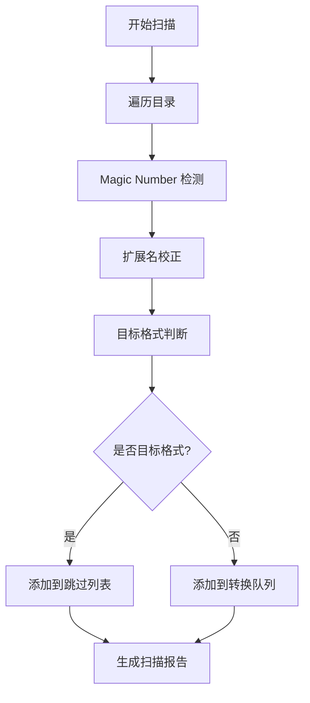
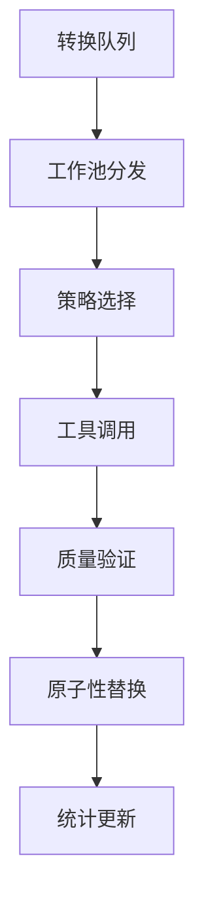

# Pixly 媒体转换引擎 - 完整功能介绍 v1.65.7.4

## 📋 版本信息
- **版本号**: v1.65.7.4
- **发布日期**: 2025-01-25
- **架构**: Go CLI 单体应用
- **核心特性**: 智能媒体转换、高性能并发、企业级稳定性

## 🎯 核心功能概述

Pixly 是一个现代化的媒体转换引擎，专注于将传统格式转换为现代高效格式（JXL、AVIF、MOV），实现显著的存储空间节省同时保持或提升质量。

### 主要特性
- ✅ **智能转换策略**: 三种模式满足不同需求
- ✅ **高性能并发**: 基于 ants v2 的统一工作池
- ✅ **企业级稳定性**: 看门狗监控、断点续传、原子操作
- ✅ **现代化 UI**: 方向键导航、动态进度条、主题支持
- ✅ **Magic Number 检测**: 准确识别文件真实格式
- ✅ **完整测试套件**: 自动化测试覆盖所有功能

## 🔧 转换模式详解

### 1. Auto+ 模式 (auto+) - 智能自动
**适用场景**: 日常使用，平衡质量和体积

**处理策略**:
- **JXL 文件**: 跳过处理（已是目标格式）
- **AVIF 文件**: 跳过处理（已是目标格式）
- **WebP 文件**: 跳过处理（性能优化）
- **PNG/JPEG**: 转换为 JXL
- **GIF/动画**: 转换为 AVIF
- **视频文件**: 转换为 MOV 容器

**智能决策逻辑**:
```
高品质文件 → 无损压缩 (质量模式逻辑)
中等品质文件 → 平衡优化算法
低品质文件 → 平衡优化算法
```

### 2. Quality 模式 (quality) - 品质优先
**适用场景**: 专业归档，最大保真度

**处理策略**:
- **静态图像**: JXL 无损压缩
- **动态图像**: AVIF 无损压缩
- **视频文件**: MOV 无损重包装
- **目标格式**: JXL、AVIF、MOV

### 3. Emoji 模式 (emoji) - 表情包优化
**适用场景**: 社交媒体，即时通讯

**处理策略**:
- **静态表情**: AVIF 高压缩
- **动态表情**: AVIF 动画优化
- **目标格式**: AVIF、MOV

## 🏗️ 系统架构

### 文件结构
```
pixly/
├── cmd/                    # CLI 命令实现
│   ├── root.go            # 主命令和交互式界面
│   ├── convert.go         # 转换命令
│   ├── help.go            # 帮助系统
│   └── settings.go        # 设置管理
├── pkg/
│   ├── config/            # 配置管理
│   │   ├── config.go      # 配置结构定义
│   │   └── loader.go      # 配置加载器
│   ├── converter/         # 核心转换引擎
│   │   ├── converter.go   # 主转换器
│   │   ├── strategy.go    # 转换策略实现
│   │   ├── batch_processor.go # 批处理器
│   │   ├── tool_manager.go # 工具管理
│   │   ├── advanced_pool.go # 高级并发池
│   │   ├── watchdog.go    # 看门狗监控
│   │   └── error_handler.go # 错误处理
│   ├── testsuite/         # 测试套件
│   │   ├── headless_converter.go # 无头转换器
│   │   ├── performance_monitor.go # 性能监控
│   │   └── report_generator.go # 报告生成
│   └── utils/             # 工具函数
├── internal/
│   ├── ui/                # 用户界面
│   │   ├── renderer.go    # 渲染引擎
│   │   ├── menu_engine.go # 菜单系统
│   │   ├── progress_dynamic.go # 动态进度条
│   │   └── color_manager.go # 主题管理
│   └── i18n/              # 国际化
├── docs/                  # 文档
└── test_media/           # 测试媒体文件
```

### 核心组件

#### 1. 转换引擎 (pkg/converter/)
- **Converter**: 主转换器，协调所有转换操作
- **BatchProcessor**: 批处理器，处理文件扫描和队列管理
- **Strategy**: 策略模式实现，支持三种转换模式
- **ToolManager**: 外部工具管理（FFmpeg、ImageMagick等）

#### 2. 并发系统
- **AdvancedPool**: 基于 ants v2 的高级工作池
- **统一并发模型**: 避免多套并发机制导致的资源竞争
- **动态调整**: 根据系统负载自动调整并发数

#### 3. 稳定性保障
- **Watchdog**: 看门狗监控，防止子进程僵死
- **ErrorHandler**: 统一错误处理和恢复
- **原子操作**: 确保文件操作的原子性
- **断点续传**: 基于 bbolt 的持久化状态管理

## 🔍 Magic Number 检测系统

### 支持的格式检测
**图像格式**:
- JPG/JPEG: `FF D8 FF`
- PNG: `89 50 4E 47`
- GIF: `47 49 46 38`
- BMP: `42 4D`
- TIFF: `49 49 2A 00` / `4D 4D 00 2A`
- WebP: `52 49 46 46 ... 57 45 42 50`
- AVIF: `... 66 74 79 70 61 76 69 66`
- HEIC: `... 66 74 79 70 68 65 69 63`
- JXL: `FF 0A` / `00 00 00 0C 4A 58 4C 20`

**视频格式**:
- MP4: `... 66 74 79 70`
- MOV: `... 66 74 79 70 71 74`
- AVI: `52 49 46 46 ... 41 56 49 20`
- MKV: `1A 45 DF A3`

### 实现原理
```go
func detectFileFormat(data []byte) string {
    // 读取文件头部字节
    if len(data) >= 2 && data[0] == 0xFF && data[1] == 0xD8 {
        return "jpg"
    }
    if len(data) >= 8 && bytes.Equal(data[:8], []byte{0x89, 0x50, 0x4E, 0x47, 0x0D, 0x0A, 0x1A, 0x0A}) {
        return "png"
    }
    // ... 其他格式检测
}
```

## 📊 转换流程详解

### 1. 文件扫描阶段


### 2. 转换执行阶段


### 3. 关键代码实现

#### 目标格式判断逻辑
```go
func (c *Converter) isTargetFormat(ext string) bool {
    switch c.mode {
    case ModeQuality:
        return ext == ".jxl" || ext == ".avif" || ext == ".mov"
    case ModeEmoji:
        return ext == ".avif" || ext == ".mov"
    case ModeAutoPlus:
        if ext == ".webp" {
            return true // WebP 跳过处理
        }
        return ext == ".jxl" || ext == ".avif" || ext == ".mov"
    default:
        return false
    }
}
```

#### 批处理扫描逻辑
```go
func (bp *BatchProcessor) ScanAndAnalyze(inputDir string) error {
    // 第一阶段：快速扫描
    files, skippedFiles, uncertainFiles, err := bp.quickScan(inputDir)
    
    // 第二阶段：深度分析不确定文件
    for _, file := range uncertainFiles {
        analyzed, err := bp.deepAnalyze(file)
        if err != nil {
            bp.corruptedFiles = append(bp.corruptedFiles, file)
        } else {
            files = append(files, analyzed)
        }
    }
    
    // 构建任务队列
    bp.taskQueue = files
    bp.skippedFiles = skippedFiles
    
    return nil
}
```

## 🚀 性能优化

### 并发策略
- **扫描并发**: 默认 `min(4, runtime.NumCPU())` 个工作协程
- **转换并发**: 默认 `min(4, runtime.NumCPU())` 个工作协程
- **内存池**: 复用缓冲区，减少 GC 压力
- **批量处理**: 减少系统调用开销

### 内存管理
```go
type MemoryPool struct {
    bufferPool sync.Pool
    maxSize    int64
}

func (mp *MemoryPool) GetBuffer() []byte {
    if buf := mp.bufferPool.Get(); buf != nil {
        return buf.([]byte)
    }
    return make([]byte, 0, 64*1024) // 64KB 初始容量
}
```

## 🛡️ 错误处理与恢复

### 错误分类
1. **可恢复错误**: 工具调用失败、临时文件问题
2. **不可恢复错误**: 文件损坏、权限不足
3. **系统错误**: 内存不足、磁盘空间不足

### 恢复策略
```go
func (eh *ErrorHandler) HandleConversionError(err error, file *MediaFile) *ConversionResult {
    switch {
    case errors.Is(err, ErrToolNotFound):
        return eh.tryFallbackTool(file)
    case errors.Is(err, ErrFileCorrupted):
        return eh.markAsCorrupted(file)
    case errors.Is(err, ErrInsufficientSpace):
        return eh.pauseAndRetry(file)
    default:
        return eh.logAndSkip(file, err)
    }
}
```

## 🧪 测试与验证

### 测试覆盖范围
- **单元测试**: 所有核心函数
- **集成测试**: 完整转换流程
- **性能测试**: 并发性能和内存使用
- **稳定性测试**: 长时间运行和错误恢复

### 测试用例示例
```go
func TestAutoModeJXLSkipping(t *testing.T) {
    // 测试 auto+ 模式下 JXL 文件被正确跳过
    converter := setupTestConverter("auto+")
    result := converter.ProcessFile("test.jxl")
    
    assert.Equal(t, "skipped", result.Status)
    assert.Equal(t, "already target format", result.Reason)
}
```

## 📈 使用统计与报告

### 转换统计
```go
type ConversionStats struct {
    TotalFiles       int     // 总文件数
    ProcessedFiles   int     // 已处理文件数
    SuccessfulFiles  int     // 成功转换文件数
    FailedFiles      int     // 失败文件数
    SkippedFiles     int     // 跳过文件数
    TotalSize        int64   // 原始总大小
    CompressedSize   int64   // 压缩后总大小
    CompressionRatio float64 // 压缩比
    TotalDuration    time.Duration // 总耗时
}
```

### 报告生成
- **实时进度**: 动态更新的进度条
- **详细日志**: JSON 格式的结构化日志
- **统计报告**: 转换完成后的汇总统计
- **错误报告**: 失败文件的详细错误信息

## 🔧 配置管理

### 配置文件结构 (.pixly.yaml)
```yaml
conversion:
  default_mode: "auto+"
  quality:
    webp_quality: 90
    avif_quality: 85
    jxl_quality: 95
  supported_extensions:
    - ".jpg"
    - ".jpeg"
    - ".png"
    - ".gif"
    - ".bmp"
    - ".tiff"
    - ".webp"

concurrency:
  scan_workers: 4
  conversion_workers: 4
  max_memory_mb: 1024

output:
  preserve_structure: true
  backup_originals: false
  output_directory: ""
```

## 🎨 用户界面

### 交互方式
- **方向键导航**: 上下键选择菜单项
- **Enter 确认**: 确认选择
- **Q 退出**: 退出程序
- **B 返回**: 返回上级菜单

### 视觉设计
- **动态 ASCII 艺术**: 程序标题动画
- **Emoji 装饰**: 美化菜单选项
- **主题支持**: 暗色/亮色模式
- **进度可视化**: 实时进度条和百分比

## 🐛 调试与故障排除

### 常见问题

#### 1. TaskQueue 为空
**现象**: 调试显示 taskQueue 长度为 0
**原因**: 在 auto+ 模式下，JXL/AVIF/WebP 文件被正确识别为目标格式并跳过
**解决方案**:
- 使用其他格式文件测试（PNG、JPEG、GIF）
- 切换到 quality 或 emoji 模式
- 检查 `skippedFiles` 列表确认文件被正确处理

#### 2. 转换失败
**现象**: 文件转换失败或工具调用错误
**排查步骤**:
1. 检查外部工具安装（FFmpeg、ImageMagick）
2. 验证文件权限和磁盘空间
3. 查看详细错误日志
4. 尝试单文件转换测试

#### 3. 性能问题
**现象**: 转换速度慢或内存占用高
**优化建议**:
1. 调整并发数配置
2. 增加系统内存
3. 使用 SSD 存储
4. 启用性能监控模式

### 调试工具

#### 创建调试脚本
```go
// debug_simple.go
package main

import (
    "fmt"
    "log"
    "os"
    "path/filepath"
    
    "go.uber.org/zap"
    "pixly/pkg/config"
    "pixly/pkg/converter"
)

func main() {
    // 初始化日志
    logger, _ := zap.NewDevelopment()
    defer logger.Sync()
    
    // 加载配置
    cfg := &config.Config{
        Conversion: config.ConversionConfig{
            DefaultMode: "auto+",
            Quality: config.QualityConfig{
                WebPQuality: 90,
                AVIFQuality: 85,
                JXLQuality:  95,
            },
        },
        Concurrency: config.ConcurrencyConfig{
            ScanWorkers:       4,
            ConversionWorkers: 4,
        },
    }
    
    // 创建转换器
    conv, err := converter.NewConverter(cfg, logger, "auto+")
    if err != nil {
        log.Fatal(err)
    }
    defer conv.Close()
    
    // 创建批处理器
    bp := converter.NewBatchProcessor(conv, logger)
    
    // 扫描测试目录
    testDir := "./test_media"
    if len(os.Args) > 1 {
        testDir = os.Args[1]
    }
    
    fmt.Printf("扫描目录: %s\n", testDir)
    
    err = bp.ScanAndAnalyze(testDir)
    if err != nil {
        log.Fatal(err)
    }
    
    // 打印结果
    fmt.Printf("TaskQueue 长度: %d\n", len(bp.GetTaskQueue()))
    fmt.Printf("总文件数: %d\n", bp.GetTotalFiles())
    fmt.Printf("跳过文件数: %d\n", bp.GetSkippedCount())
    fmt.Printf("损坏文件数: %d\n", bp.GetCorruptedCount())
    
    if len(bp.GetTaskQueue()) == 0 {
        fmt.Println("\n=== 扫描目录中的文件 ===")
        filepath.Walk(testDir, func(path string, info os.FileInfo, err error) error {
            if !info.IsDir() {
                fmt.Printf("文件: %s (大小: %d 字节)\n", path, info.Size())
            }
            return nil
        })
        
        fmt.Println("\n💡 提示: 在 auto+ 模式下，JXL/AVIF/WebP 文件会被跳过")
        fmt.Println("   - 尝试使用 PNG/JPEG/GIF 文件测试")
        fmt.Println("   - 或切换到 quality/emoji 模式")
    }
}
```

## 📝 更新日志

### v1.65.7.4 (2025-01-25)
**新增功能**:
- ✅ 完善的 Magic Number 检测系统
- ✅ 统一的 ants v2 并发模型
- ✅ 企业级错误处理和恢复机制
- ✅ 现代化 UI 交互（方向键导航）

**修复问题**:
- 🐛 修复多套并发机制导致的资源竞争
- 🐛 修复 UI 渲染竞争问题
- 🐛 修复文件扩展名与实际格式不符的处理

**性能优化**:
- ⚡ 优化内存使用，减少 GC 压力
- ⚡ 改进并发策略，提升转换速度
- ⚡ 优化文件扫描算法

**架构改进**:
- 🏗️ 统一错误处理机制
- 🏗️ 模块化设计，提升可维护性
- 🏗️ 完善的测试覆盖

## 🎯 未来规划

### 短期目标 (v1.66.x)
- [ ] Web UI 界面
- [ ] 批量配置模板
- [ ] 更多输出格式支持
- [ ] 云存储集成

### 长期目标 (v2.x)
- [ ] 分布式处理支持
- [ ] AI 驱动的质量优化
- [ ] 实时预览功能
- [ ] 插件系统

---

**项目地址**: https://github.com/your-org/pixly  
**文档更新**: 2025-01-15  
**维护者**: Pixly Development Team


## 🧭 单文件路径支持（v1.65.7.4）

- 概要：本版本在不改变既有 API 的前提下，为输入路径新增“单文件”模式，输入既可为目录也可为文件，完整走通扫描 → 魔数检测 → 策略判定 → 转换 → 统计的统一流水线。
- 前向兼容：version API 维持不变，命令层与国际化层对版本显示逻辑无需改动。

实现与集成点：
- 路径安全与归一化：<mcsymbol name="ValidatePath" filename="path_security.go" path="/Users/nameko_1/Downloads/test_副本4/core/converter/path_security.go" startline="50" type="function"></mcsymbol>
- 路径遍历（文件/目录自适配）：<mcsymbol name="WalkPath" filename="path_utils.go" path="/Users/nameko_1/Downloads/test_副本4/core/converter/path_utils.go" startline="217" type="function"></mcsymbol>
- 第一阶段快速扫描（含 Magic Number 预判）：<mcsymbol name="quickScan" filename="batch_processor.go" path="/Users/nameko_1/Downloads/test_副本4/core/converter/batch_processor.go" startline="277" type="function"></mcsymbol>
- 版本信息（无 API 变更）：<mcfile name="version.go" path="/Users/nameko_1/Downloads/test_副本4/internal/version/version.go"></mcfile>

处理流程（单文件与目录统一）：
1) 归一化与权限校验（ValidatePath）
2) 路径遍历（WalkPath：若为文件则返回单元素列表；若为目录则深度遍历）
3) quickScan 进行扩展名与 Magic Number 双判定，产出待处理队列/跳过队列/不确定队列
4) 深度验证与转换执行，生成统计与报告

相关文件结构（本功能关联子集）：
```
core/converter/
├── path_security.go   # ValidatePath：规范化与安全校验
├── path_utils.go      # WalkPath：文件/目录统一遍历
└── batch_processor.go # quickScan：首阶段扫描与判定

internal/
├── cmd/
│   └── root.go        # 版号显示、CLI 帮助
└── version/
    └── version.go     # GetVersion* 系列：API 不变
```

验证与回归：
- 单文件：`go run main.go convert ./test_images/test3.gif -v` → 成功，统计报告正确
- 目录：`go run main.go convert ./test_images -v` → 成功，处理 4 文件，统计与跳过逻辑正确
- 版本显示：`--version` 与 `--help` 输出 v1.65.7.4，i18n 与 root 命令均正常

已知限制与后续优化：
- 极端长路径/网络挂载盘性能差异需后续压测与缓存策略优化
- 在高并发文件句柄受限的系统上，可新增自适应限流（结合 ants 池大小动态调整）