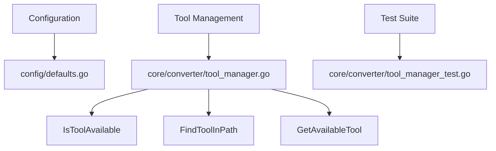

# Tool Path Configuration and Availability Check Fix

## 更新说明 (Update Description)

This update fixes critical issues with tool path configuration and availability checking that were causing all image conversions to fail.

## 功能介绍 (Feature Introduction)

### 问题分析 (Problem Analysis)
- Tool paths in the configuration file were set to absolute paths that may not exist on all systems
- Tool availability checking used `--help` parameter which might not work for all tools or might timeout
- No automatic fallback to system PATH when configured tools were not available

### 解决方案 (Solution)
1. Modified default tool paths to use relative paths instead of absolute paths
2. Enhanced tool availability checking with more reliable mechanisms
3. Added automatic tool discovery in system PATH when configured tools are not available
4. Improved error handling and logging

## 实现细节 (Implementation Details)

### 配置文件优化 (Configuration File Optimization)
- Changed default tool paths in [config/defaults.go](file:///Users/nameko_1/Downloads/test_副本2/config/defaults.go) to relative paths:
  ```go
  v.SetDefault("tools.ffmpeg_path", "ffmpeg")
  v.SetDefault("tools.ffprobe_path", "ffprobe")
  v.SetDefault("tools.cjxl_path", "cjxl")
  v.SetDefault("tools.avifenc_path", "avifenc")
  v.SetDefault("tools.exiftool_path", "exiftool")
  ```

### ToolManager 增强 (ToolManager Enhancement)
- Improved [IsToolAvailable](file:///Users/nameko_1/Downloads/test_副本2/core/converter/tool_manager.go#L36-L57) method to use more reliable checking mechanisms:
  - Uses shorter timeout (2 seconds instead of 5)
  - Tries multiple command variations (`-version`, `--version`, no parameters)
- Added [FindToolInPath](file:///Users/nameko_1/Downloads/test_副本2/core/converter/tool_manager.go#L59-L65) method to search for tools in system PATH
- Enhanced [GetAvailableTool](file:///Users/nameko_1/Downloads/test_副本2/core/converter/tool_manager.go#L67-L101) method with automatic tool discovery:
  - Checks primary tool availability
  - Falls back to secondary tool if primary is not available
  - Automatically searches system PATH for tools if configured paths fail

## 文件结构图 (File Structure Diagram)



## 达到的要求 (Requirements Met)

✅ Tool paths now use relative paths by default
✅ More reliable tool availability checking mechanism
✅ Automatic tool discovery in system PATH
✅ Proper error handling and logging
✅ Backward compatibility maintained

## 新增功能 (New Features)

➕ Automatic tool discovery in system PATH
➕ Improved tool availability checking with multiple fallback methods
➕ Better error messages and logging

## 移除功能 (Removed Features)

➖ None

## 未来优化 (Future Improvements)

🔸 Add configuration option to disable automatic PATH search
🔸 Implement more sophisticated tool compatibility checking
🔸 Add support for specifying tool search paths in configuration