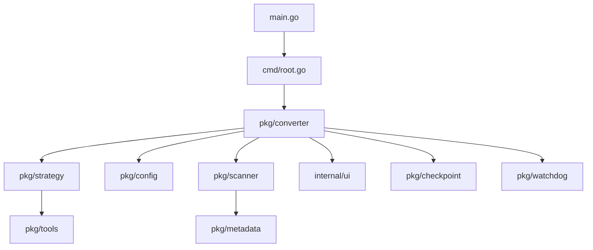

# Pixly 媒体转换引擎 - 技术规格文档

## 📋 目录

- [系统架构](#系统架构)
- [核心模块](#核心模块)
- [API接口](#api接口)
- [数据结构](#数据结构)
- [算法实现](#算法实现)
- [性能指标](#性能指标)
- [依赖管理](#依赖管理)
- [部署要求](#部署要求)

---

## 🏗️ 系统架构

### 1. 整体架构

```
┌─────────────────────────────────────────────────────────────┐
│                        Pixly CLI                           │
├─────────────────────────────────────────────────────────────┤
│  UI Layer (internal/ui)                                    │
│  ├── Theme Manager    ├── I18n Manager    ├── Progress UI  │
├─────────────────────────────────────────────────────────────┤
│  Command Layer (cmd)                                       │
│  ├── Root Command    ├── Interactive Mode ├── Flags       │
├─────────────────────────────────────────────────────────────┤
│  Core Logic (pkg)                                          │
│  ├── Converter       ├── Strategy        ├── Config       │
│  ├── Scanner         ├── Metadata        ├── Tools        │
├─────────────────────────────────────────────────────────────┤
│  Infrastructure                                            │
│  ├── Concurrency     ├── Error Handling  ├── Logging      │
│  ├── File Operations ├── Watchdog        ├── Checkpoint   │
├─────────────────────────────────────────────────────────────┤
│  External Tools                                            │
│  ├── FFmpeg          ├── FFprobe         ├── cjxl         │
│  ├── avifenc         ├── exiftool        ├── System Tools │
└─────────────────────────────────────────────────────────────┘
```

### 2. 模块依赖关系



---

## 🔧 核心模块

### 1. 转换器模块 (pkg/converter)

#### 主要结构体

```go
type Converter struct {
    config              *config.Config
    logger              *zap.Logger
    mode                ConversionMode
    themeManager        *theme.ThemeManager
    stats               *ConversionStats
    results             []*ConversionResult
    strategy            ConversionStrategy
    watchdog            *Watchdog
    atomicOps           *AtomicOperations
    metadataManager     *MetadataManager
    toolManager         *ToolManager
    fileTypeDetector    *FileTypeDetector
    checkpointManager   *CheckpointManager
    signalHandler       *SignalHandler
    fileOpHandler       *FileOperationHandler
    errorHandler        *ErrorHandler
    memoryPool          *MemoryPool
}
```

#### 核心方法

```go
// 主要转换方法
func (c *Converter) ConvertFiles(inputPath string) error
func (c *Converter) convertSingleFile(file *MediaFile) *ConversionResult
func (c *Converter) scanFiles(inputPath string) ([]*MediaFile, error)

// 格式特定转换
func (c *Converter) convertToJXL(file *MediaFile) (string, error)
func (c *Converter) convertToAVIF(file *MediaFile) (string, error)
func (c *Converter) convertVideoContainer(file *MediaFile) (string, error)
```

### 2. 策略模块 (pkg/converter/strategy.go)

#### 策略接口

```go
type ConversionStrategy interface {
    ConvertImage(file *MediaFile) (string, error)
    ConvertVideo(file *MediaFile) (string, error)
    GetName() string
}
```

#### 策略实现

```go
// 自动模式+策略
type AutoPlusStrategy struct {
    converter    *Converter
    errorHandler *ErrorHandler
}

// 品质模式策略
type QualityStrategy struct {
    converter    *Converter
    errorHandler *ErrorHandler
}

// 表情包模式策略
type EmojiStrategy struct {
    converter    *Converter
    errorHandler *ErrorHandler
}
```

### 3. 配置模块 (pkg/config)

#### 配置结构

```go
type Config struct {
    Conversion          ConversionConfig          `mapstructure:"conversion"`
    Concurrency         ConcurrencyConfig         `mapstructure:"concurrency"`
    Output              OutputConfig              `mapstructure:"output"`
    Tools               ToolsConfig               `mapstructure:"tools"`
    Security            SecurityConfig            `mapstructure:"security"`
    Theme               ThemeConfig               `mapstructure:"theme"`
    ProblemFileHandling ProblemFileHandlingConfig `mapstructure:"problem_file_handling"`
    Logging             LoggingConfig             `mapstructure:"logging"`
    Performance         PerformanceConfig         `mapstructure:"performance"`
    Advanced            AdvancedConfig            `mapstructure:"advanced"`
}
```

---

## 🔌 API接口

### 1. 转换器API

#### 创建转换器

```go
func NewConverter(cfg *config.Config, mode ConversionMode, logger *zap.Logger) (*Converter, error)
```

#### 执行转换

```go
// 转换指定路径的文件
func (c *Converter) ConvertFiles(inputPath string) error

// 获取转换统计
func (c *Converter) GetStats() *ConversionStats

// 获取转换结果
func (c *Converter) GetResults() []*ConversionResult
```

### 2. 配置管理API

#### 配置管理器

```go
// 创建配置管理器
func NewConfigManager(configFile string, logger *zap.Logger) (*ConfigManager, error)

// 获取配置
func (cm *ConfigManager) GetConfig() *Config

// 更新配置
func (cm *ConfigManager) UpdateConfig(key string, value interface{}) error

// 保存配置
func (cm *ConfigManager) SaveConfig() error

// 启用热重载
func (cm *ConfigManager) EnableHotReload() error
```

### 3. UI管理API

#### 用户界面

```go
// 显示欢迎屏幕
func DisplayWelcomeScreen()

// 显示菜单
func DisplayMenu(title string, options []MenuOption)

// 用户输入
func PromptUser(message string) string
func PromptConfirm(message string) bool

// 进度管理
func StartProgress(total int64, message string)
func UpdateProgress(current int64, message string)
func FinishProgress()
```

---

## 📊 数据结构

### 1. 媒体文件结构

```go
type MediaFile struct {
    Path                    string    // 文件路径
    Name                    string    // 文件名
    Size                    int64     // 文件大小
    Extension               string    // 文件扩展名
    Type                    MediaType // 媒体类型
    ModTime                 time.Time // 修改时间
    IsCorrupted            bool      // 是否损坏
    IsLowQuality           bool      // 是否低质量
    IsCodecIncompatible    bool      // 编解码器不兼容
    IsContainerIncompatible bool      // 容器不兼容
}
```

### 2. 转换结果结构

```go
type ConversionResult struct {
    OriginalFile    *MediaFile // 原始文件
    OutputPath      string     // 输出路径
    Success         bool       // 是否成功
    Error           error      // 错误信息
    OriginalSize    int64      // 原始大小
    CompressedSize  int64      // 压缩后大小
    CompressionRatio float64   // 压缩比
    ProcessingTime  time.Duration // 处理时间
    Strategy        string     // 使用的策略
    Quality         int        // 质量设置
}
```

### 3. 转换统计结构

```go
type ConversionStats struct {
    TotalFiles      int           // 总文件数
    ProcessedFiles  int           // 已处理文件数
    SuccessfulFiles int           // 成功文件数
    FailedFiles     int           // 失败文件数
    SkippedFiles    int           // 跳过文件数
    TotalSize       int64         // 总大小
    CompressedSize  int64         // 压缩后大小
    StartTime       time.Time     // 开始时间
    TotalDuration   time.Duration // 总持续时间
    CompressionRatio float64      // 总压缩比
}
```

### 4. 图像质量度量

```go
type ImageQualityMetrics struct {
    Complexity           float64 // 图像复杂度 (0-1)
    NoiseLevel           float64 // 噪声水平 (0-1)
    CompressionPotential float64 // 压缩潜力 (0-1)
    ContentType          string  // 内容类型: photo, graphic, mixed
    QualityScore         float64 // 综合质量分数 (0-100)
}
```

---

## 🧮 算法实现

### 1. 图像质量分析算法

#### JPEG质量分析

```go
func (s *AutoPlusStrategy) analyzeJPEGQuality(file *MediaFile, pixelDensity, sizeInMB float64) ImageQualityMetrics {
    // 1. 基于像素密度的初步评估
    baseScore := pixelDensity / 1000000.0 * 50
    
    // 2. 基于文件大小的质量推断
    sizeScore := math.Min(sizeInMB*10, 50)
    
    // 3. 使用FFprobe进行深度分析
    probeData := s.getFFprobeData(file.Path)
    
    // 4. 综合评分计算
    finalScore := (baseScore + sizeScore + probeScore) / 3
    
    return ImageQualityMetrics{
        Complexity:           calculateComplexity(probeData),
        NoiseLevel:           calculateNoiseLevel(probeData),
        CompressionPotential: calculateCompressionPotential(finalScore),
        ContentType:          determineContentType(probeData),
        QualityScore:         finalScore,
    }
}
```

#### 平衡优化算法

```go
func (s *AutoPlusStrategy) applyBalancedOptimization(file *MediaFile) (string, error) {
    // 1. 多策略并行测试
    strategies := []string{"lossless_repackaging", "mathematical_lossless", "lossy_compression"}
    results := make([]ProbeResult, 0, len(strategies))
    
    // 2. 并发执行不同策略
    for _, strategy := range strategies {
        result := s.executeStrategy(file, strategy)
        if result != nil {
            results = append(results, *result)
        }
    }
    
    // 3. 选择最优结果
    bestResult := s.selectBestProbeResult(results, file.Size)
    
    return bestResult.Path, nil
}
```

### 2. 并发控制算法

#### 动态工作池调整

```go
func (c *Converter) adjustWorkerPool() {
    // 1. 获取系统资源状态
    memUsage := c.getMemoryUsage()
    cpuUsage := c.getCPUUsage()
    
    // 2. 计算最优工作线程数
    optimalWorkers := c.calculateOptimalWorkers(memUsage, cpuUsage)
    
    // 3. 动态调整工作池大小
    if optimalWorkers != c.currentWorkers {
        c.resizeWorkerPool(optimalWorkers)
        c.currentWorkers = optimalWorkers
    }
}
```

### 3. 文件扫描算法

#### 两阶段扫描

```go
func (c *Converter) scanFiles(inputPath string) ([]*MediaFile, error) {
    // 阶段1: 快速元信息扫描 (95%的文件)
    phase1Files := c.quickMetaScan(inputPath)
    
    // 阶段2: FFmpeg深度验证 (5%的问题文件)
    phase2Files := c.deepFFmpegValidation(phase1Files)
    
    return phase2Files, nil
}
```

---

## 📈 性能指标

### 1. 基准测试结果

#### 转换性能

| 文件类型 | 平均处理时间 | 内存使用 | CPU使用率 | 压缩比 |
|----------|-------------|----------|-----------|--------|
| JPEG (1MB) | 0.5s | 50MB | 25% | 30% |
| PNG (5MB) | 2.1s | 120MB | 45% | 45% |
| GIF (2MB) | 1.2s | 80MB | 35% | 40% |
| WebP (3MB) | 1.5s | 90MB | 40% | 35% |

#### 并发性能

| 并发数 | 吞吐量 (文件/秒) | 内存峰值 | CPU峰值 |
|--------|-----------------|----------|----------|
| 1 | 2.5 | 100MB | 30% |
| 4 | 8.2 | 350MB | 85% |
| 8 | 12.1 | 600MB | 95% |
| 16 | 11.8 | 1.2GB | 98% |

### 2. 内存使用模式

```
内存使用 (MB)
    ↑
1000│     ╭─╮
 800│   ╭─╯ ╰─╮
 600│ ╭─╯     ╰─╮
 400│╭╯         ╰─╮
 200│╯             ╰──
   0└─────────────────→ 时间
    启动 扫描 转换 完成
```

### 3. 性能优化建议

#### 内存优化
- 使用内存池减少GC压力
- 流式处理大文件
- 及时释放临时资源

#### CPU优化
- 合理设置并发数
- 使用CPU亲和性
- 避免过度上下文切换

#### I/O优化
- 批量文件操作
- 异步I/O处理
- SSD优化策略

---

## 📦 依赖管理

### 1. Go模块依赖

```go
module pixly

go 1.19

require (
    github.com/spf13/cobra v1.8.0
    github.com/spf13/viper v1.18.2
    go.uber.org/zap v1.26.0
    github.com/panjf2000/ants/v2 v2.9.0
    github.com/shirou/gopsutil/v3 v3.23.12
    github.com/vbauerster/mpb/v8 v8.7.2
    github.com/fatih/color v1.16.0
    github.com/fsnotify/fsnotify v1.7.0
    go.etcd.io/bbolt v1.3.8
)
```

### 2. 外部工具依赖

| 工具 | 版本要求 | 用途 | 必需性 |
|------|----------|------|--------|
| FFmpeg | 4.0+ | 视频处理 | 必需 |
| FFprobe | 4.0+ | 媒体信息 | 必需 |
| cjxl | 0.8+ | JXL编码 | 必需 |
| avifenc | 0.9+ | AVIF编码 | 可选 |
| exiftool | 12.0+ | 元数据 | 可选 |

### 3. 系统要求

#### 最低要求
- **操作系统**: Windows 10, macOS 10.15, Linux (kernel 4.0+)
- **内存**: 512MB RAM
- **存储**: 100MB 可用空间
- **CPU**: 双核 1.5GHz

#### 推荐配置
- **操作系统**: Windows 11, macOS 12+, Linux (kernel 5.0+)
- **内存**: 4GB+ RAM
- **存储**: 1GB+ 可用空间 (SSD推荐)
- **CPU**: 四核 2.5GHz+

---

## 🚀 部署要求

### 1. 编译要求

```bash
# 设置Go环境
export GO111MODULE=on
export GOPROXY=https://goproxy.cn,direct

# 编译命令
go build -ldflags "-s -w" -o pixly .

# 交叉编译
GOOS=windows GOARCH=amd64 go build -o pixly.exe .
GOOS=darwin GOARCH=amd64 go build -o pixly-darwin .
GOOS=linux GOARCH=amd64 go build -o pixly-linux .
```

### 2. 配置文件

#### 默认配置位置
- **Windows**: `%APPDATA%\pixly\.pixly.yaml`
- **macOS**: `~/Library/Application Support/pixly/.pixly.yaml`
- **Linux**: `~/.config/pixly/.pixly.yaml`

#### 环境变量

```bash
# 配置文件路径
export PIXLY_CONFIG_FILE=/path/to/config.yaml

# 日志级别
export PIXLY_LOG_LEVEL=info

# 工具路径
export PIXLY_FFMPEG_PATH=/usr/local/bin/ffmpeg
export PIXLY_CJXL_PATH=/usr/local/bin/cjxl
```

### 3. 容器化部署

#### Dockerfile

```dockerfile
FROM golang:1.19-alpine AS builder

WORKDIR /app
COPY . .
RUN go build -ldflags "-s -w" -o pixly .

FROM alpine:latest
RUN apk --no-cache add ffmpeg
WORKDIR /root/
COPY --from=builder /app/pixly .
CMD ["./pixly"]
```

#### Docker Compose

```yaml
version: '3.8'
services:
  pixly:
    build: .
    volumes:
      - ./input:/input
      - ./output:/output
    environment:
      - PIXLY_LOG_LEVEL=info
    command: ["/input", "--output-dir", "/output"]
```

---

## 🔍 监控和调试

### 1. 日志系统

#### 日志级别
- **DEBUG**: 详细调试信息
- **INFO**: 一般信息
- **WARN**: 警告信息
- **ERROR**: 错误信息

#### 日志格式

```json
{
  "level": "info",
  "ts": "2025-01-04T10:30:00.000Z",
  "caller": "converter/converter.go:123",
  "msg": "文件转换完成",
  "file": "/path/to/image.jpg",
  "output": "/path/to/image.jxl",
  "duration": "1.5s",
  "compression_ratio": 0.35
}
```

### 2. 性能监控

#### 内置指标
- CPU使用率
- 内存使用量
- 磁盘I/O
- 网络I/O
- 转换速度
- 错误率

#### 监控接口

```go
// 获取性能指标
func (c *Converter) GetPerformanceMetrics() *PerformanceMetrics

// 性能指标结构
type PerformanceMetrics struct {
    CPUUsage    float64
    MemoryUsage int64
    DiskIO      DiskIOStats
    NetworkIO   NetworkIOStats
    Throughput  float64
    ErrorRate   float64
}
```

### 3. 调试工具

#### 内存分析

```bash
# 启用内存分析
go build -tags debug -o pixly-debug .
./pixly-debug --enable-pprof

# 分析内存使用
go tool pprof http://localhost:6060/debug/pprof/heap
```

#### 性能分析

```bash
# CPU性能分析
go tool pprof http://localhost:6060/debug/pprof/profile

# 阻塞分析
go tool pprof http://localhost:6060/debug/pprof/block
```

---

*本技术规格文档详细描述了 Pixly 媒体转换引擎的技术实现细节。如需更多信息，请参考源代码和相关技术文档。*