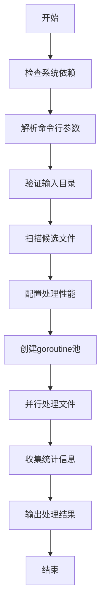
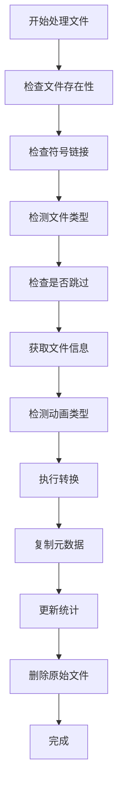

# 🔄 AVIF 转换处理流程

本文档详细描述了AVIF批量转换工具的处理流程和内部机制。

## 📋 整体流程

## 🔍 详细步骤

### 1. 初始化阶段

1. **设置日志系统**
   - 创建日志文件 `all2avif.log`
   - 同时输出到控制台和文件

2. **检查系统依赖**
   - 验证 `ffmpeg` 是否安装
   - 验证 `exiftool` 是否安装
   - 检查系统资源（CPU核心数等）

3. **解析命令行参数**
   - 工作线程数（默认10）
   - 图像质量（默认80）
   - 编码速度（默认4）
   - 输入/输出目录
   - 其他选项

### 2. 文件扫描阶段

1. **遍历输入目录**
   - 使用 `godirwalk` 高效遍历目录树
   - 跳过子目录，只处理文件

2. **文件类型检测**
   - 使用 `filetype` 库检测文件类型
   - 支持格式：JPG, PNG, GIF, WebP, BMP, TIFF, HEIC, AVIF

3. **过滤候选文件**
   - 跳过不支持的格式
   - 跳过视频文件
   - 跳过符号链接
   - 跳过已存在的AVIF文件（如果启用skip-exist）

### 3. 处理配置阶段

1. **性能配置**
   - 根据CPU核心数设置工作线程
   - 设置进程信号量限制
   - 设置文件句柄限制

2. **创建goroutine池**
   - 使用 `ants` 库创建高性能goroutine池
   - 避免goroutine泄漏

### 4. 并行处理阶段

每个文件的处理流程：

#### 4.1 文件验证

1. **存在性检查**
   - 验证文件是否仍然存在
   - 处理并发访问冲突

2. **类型检查**
   - 跳过视频文件
   - 跳过不支持的格式
   - 跳过符号链接

3. **重复检查**
   - 检查是否已存在对应的AVIF文件
   - 如果存在且启用skip-exist，则跳过

#### 4.2 动画检测

1. **GIF动画检测**
   - 打开GIF文件
   - 解析GIF配置
   - 检查LoopCount属性

2. **其他动画格式**
   - WebP动画检测
   - 其他可能的动画格式

#### 4.3 转换执行

1. **构建ffmpeg命令**
   - 静态图像：使用标准参数
   - 动画图像：使用动画优化参数

2. **参数配置**
   - 质量设置：CRF值计算
   - 速度设置：CPU使用级别
   - 像素格式：yuv420p
   - 其他优化参数

3. **执行转换**
   - 设置超时控制
   - 执行ffmpeg命令
   - 处理错误和重试

#### 4.4 后处理

1. **元数据复制**
   - 使用exiftool复制元数据
   - 保留EXIF、IPTC、XMP等信息

2. **文件清理**
   - 如果启用replace选项，删除原始文件
   - 更新统计信息

### 5. 统计收集阶段

1. **实时统计**
   - 成功/失败计数
   - 文件大小统计
   - 处理时间统计

2. **详细日志**
   - 记录每个文件的处理信息
   - 包含错误信息和性能数据

### 6. 结果输出阶段

1. **详细摘要**
   - 按格式统计成功率
   - 计算平均压缩率
   - 显示处理时间最长的文件

2. **简单摘要**
   - 总体成功/失败数量
   - 大小统计和压缩率
   - 格式分布统计

## ⚡ 性能优化

### 并发控制

1. **Goroutine池**
   - 限制并发goroutine数量
   - 避免创建过多goroutine

2. **进程限制**
   - 限制同时运行的ffmpeg进程
   - 防止系统资源耗尽

3. **文件句柄限制**
   - 控制同时打开的文件数量
   - 避免文件句柄耗尽

### 内存管理

1. **文件读取**
   - 只读取文件头进行类型检测
   - 避免将整个文件加载到内存

2. **缓冲区管理**
   - 合理设置缓冲区大小
   - 及时释放不需要的内存

### 错误处理

1. **重试机制**
   - 支持失败重试
   - 指数退避策略

2. **超时控制**
   - 防止单个文件处理时间过长
   - 可配置的超时时间

3. **信号处理**
   - 支持优雅中断
   - 清理临时文件

## 🔧 配置参数

### 质量设置

| 质量值 | CRF值 | 说明 |
|--------|-------|------|
| 100 | 0 | 最高质量 |
| 90 | 9 | 高质量 |
| 80 | 17 | 默认质量 |
| 70 | 25 | 中等质量 |
| 60 | 33 | 低质量 |
| 50 | 41 | 最低质量 |

### 速度设置

| 速度值 | CPU使用 | 说明 |
|--------|---------|------|
| 0 | 最高 | 最慢，质量最好 |
| 1 | 高 | 慢，质量好 |
| 2 | 中高 | 较慢，质量较好 |
| 3 | 中 | 中等速度和质量 |
| 4 | 中低 | 默认设置 |
| 5 | 低 | 较快，质量一般 |
| 6 | 最低 | 最快，质量较差 |

## 📊 监控指标

### 处理统计

- 总文件数
- 成功处理数
- 失败处理数
- 跳过文件数

### 性能统计

- 总处理时间
- 平均处理时间
- 最长处理时间
- 处理速度（文件/秒）

### 压缩统计

- 原始总大小
- 转换后总大小
- 节省空间
- 平均压缩率

## 🐛 故障排除

### 常见错误

1. **依赖缺失**
   - 检查ffmpeg和exiftool安装
   - 验证PATH环境变量

2. **权限问题**
   - 检查文件读写权限
   - 确保输出目录可写

3. **内存不足**
   - 减少工作线程数
   - 检查系统内存使用

4. **磁盘空间不足**
   - 清理临时文件
   - 确保有足够空间

### 调试技巧

1. **启用详细日志**
   - 查看日志文件
   - 分析错误信息

2. **使用试运行模式**
   - 使用`-dry-run`参数
   - 验证文件扫描结果

3. **单文件测试**
   - 先测试单个文件
   - 验证转换参数

## 🔄 更新日志

### v2.0.0
- 合并dynamic2avif和static2avif功能
- 统一静态和动态图像处理
- 改进错误处理和统计
- 优化性能和内存使用

