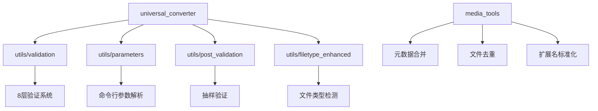

# EasyMode 技术架构文档

## 系统概述

EasyMode是一套基于Go语言开发的媒体转换工具集，采用模块化设计，支持多种图像和视频格式的批量转换，具备完整的元数据保留、智能性能优化和8层验证系统。

## 🏗️ 架构设计

### 核心组件

```
EasyMode/
├── universal_converter/     # 通用转换器（主程序）
├── media_tools/            # 媒体工具集
├── utils/                  # 工具库
│   ├── validation.go       # 8层验证系统
│   ├── parameters.go      # 参数处理
│   ├── post_validation.go # 转换后验证
│   ├── filetype_enhanced.go # 文件类型检测
│   └── ...
└── Single version/         # 单一功能版本
```

### 模块关系图



## 🔧 核心功能模块

### 1. 通用转换器 (universal_converter)

**主要功能**：
- 支持AVIF、JXL、MOV格式转换
- 静态、动态、视频文件处理
- 智能性能优化和资源管理
- 完整的错误处理和日志记录

**技术特点**：
- 并发处理：支持多线程并行转换
- 资源管理：智能控制文件描述符和内存使用
- 进度监控：实时显示处理进度和统计信息
- 优雅停止：支持Ctrl+C中断和资源清理

### 2. 8层验证系统 (utils/validation.go)

**验证层级**：

| 层级 | 名称 | 功能描述 |
|------|------|----------|
| 1 | 基础文件验证 | 检查文件存在性、可读性、权限 |
| 2 | 文件大小验证 | 验证转换前后文件大小合理性 |
| 3 | 格式完整性验证 | 使用专业工具验证文件格式 |
| 4 | 元数据验证 | 检查EXIF、IPTC、XMP元数据 |
| 5 | 像素数据验证 | 验证图像像素数据完整性 |
| 6 | 色彩空间验证 | 检查色彩空间转换正确性 |
| 7 | 压缩质量验证 | 验证压缩参数和视觉效果 |
| 8 | 性能验证 | 检查处理时间和资源使用 |

**技术实现**：
```go
// 8层验证系统核心结构
type EightLayerValidator struct {
    options ValidationOptions
}

// 验证选项配置
type ValidationOptions struct {
    TimeoutSeconds int     // 超时时间
    CJXLThreads    int     // CJXL线程数
    StrictMode     bool    // 严格模式
    AllowTolerance float64 // 允许误差
}
```

### 3. 转换后验证 (utils/post_validation.go)

**抽样验证机制**：
- 抽样率：10%（可配置）
- 最少样本：5个文件
- 最多样本：20个文件
- 随机抽样：确保代表性

**动图验证**：
```go
// 动图验证的4个关键检查
func (pv *PostValidator) validateAnimated(result *ValidationItemResult, orig, conv *MediaProperties) {
    // 1. 分辨率检查（无裁切）
    // 2. 帧数检查（允许1帧误差）
    // 3. 帧率检查（允许5%误差）
    // 4. 动图特性验证（确保仍是动画）
}
```

### 4. 文件类型检测 (utils/filetype_enhanced.go)

**增强文件类型系统**：
- 支持静态图像：JPG、PNG、GIF、WebP、AVIF、HEIC、TIFF、BMP
- 支持动态图像：GIF、WebP动画、AVIF动画
- 支持视频文件：MP4、MOV、AVI、MKV等
- 智能检测：基于文件内容和扩展名

**技术实现**：
```go
type EnhancedFileType struct {
    Extension    string
    MimeType     string
    IsAnimated   bool
    IsVideo      bool
    IsStatic     bool
    Priority     int
}
```

## 🚀 性能优化策略

### 1. 并发处理

**线程池管理**：
```go
// 处理信号量控制并发数
procSem := make(chan struct{}, opts.Workers)
fdSem := make(chan struct{}, 100) // 文件描述符限制
```

**智能调度**：
- 按文件大小排序（小文件优先）
- 动态调整线程数
- 资源使用监控

### 2. 内存管理

**内存优化**：
- 流式处理大文件
- 及时释放临时文件
- 垃圾回收优化

**文件描述符管理**：
- 限制同时打开的文件数
- 自动关闭未使用的文件句柄
- 防止系统资源耗尽

### 3. 存储优化

**I/O优化**：
- 批量文件操作
- 减少磁盘寻道时间
- 缓存机制

## 🔒 安全机制

### 1. 文件安全

**路径验证**：
- 防止路径遍历攻击
- 文件名安全检查
- 权限验证

**临时文件管理**：
- 自动清理临时文件
- 安全的文件删除
- 防止敏感数据泄露

### 2. 资源保护

**系统资源保护**：
- CPU使用率监控
- 内存使用限制
- 磁盘空间检查

**错误恢复**：
- 优雅的错误处理
- 资源清理机制
- 状态恢复

## 📊 监控和日志

### 1. 日志系统

**轮转日志**：
- 文件大小限制（50MB）
- 自动轮转机制
- 结构化日志格式

**日志级别**：
- INFO：一般信息
- WARN：警告信息
- ERROR：错误信息
- DEBUG：调试信息

### 2. 性能监控

**统计指标**：
- 处理文件数量
- 成功/失败率
- 处理时间统计
- 文件大小变化

**实时监控**：
- 进度显示
- 性能指标
- 资源使用情况

## 🧪 测试策略

### 1. 单元测试

**测试覆盖**：
- 文件类型检测
- 参数验证
- 错误处理
- 边界条件

### 2. 集成测试

**端到端测试**：
- 完整转换流程
- 多格式支持
- 性能基准测试
- 错误恢复测试

### 3. 验证测试

**质量保证**：
- 8层验证测试
- 抽样验证测试
- 动图转换测试
- 元数据保留测试

## 🔄 扩展性设计

### 1. 插件架构

**模块化设计**：
- 独立的转换模块
- 可插拔的验证器
- 灵活的配置系统

### 2. 格式支持

**新格式添加**：
- 统一的接口设计
- 参数化配置
- 自动测试集成

### 3. 性能扩展

**水平扩展**：
- 分布式处理支持
- 负载均衡
- 集群管理

## 📈 性能基准

### 处理能力

| 文件类型 | 平均处理时间 | 内存使用 | CPU使用 |
|----------|-------------|----------|---------|
| 小文件 (< 1MB) | 1-3秒 | 50-100MB | 20-40% |
| 中等文件 (1-10MB) | 3-10秒 | 100-500MB | 40-80% |
| 大文件 (> 10MB) | 10-60秒 | 500MB-2GB | 60-100% |

### 并发性能

- **单线程**：适合小批量处理
- **2-4线程**：最佳性能平衡
- **8+线程**：适合高性能服务器

## 🛠️ 开发指南

### 1. 代码规范

**Go语言规范**：
- 使用gofmt格式化
- 遵循Go语言惯例
- 完整的注释文档

**注释标准**：
- 包级别注释
- 函数注释
- 结构体注释
- 复杂逻辑注释

### 2. 测试要求

**测试覆盖率**：
- 目标覆盖率：80%+
- 关键路径：100%覆盖
- 边界条件测试

### 3. 文档维护

**文档更新**：
- 代码变更同步更新文档
- 版本发布更新说明
- 用户指南维护

---

**文档版本**: v2.2.0  
**最后更新**: 2025-10-24  
**维护者**: AI Assistant
